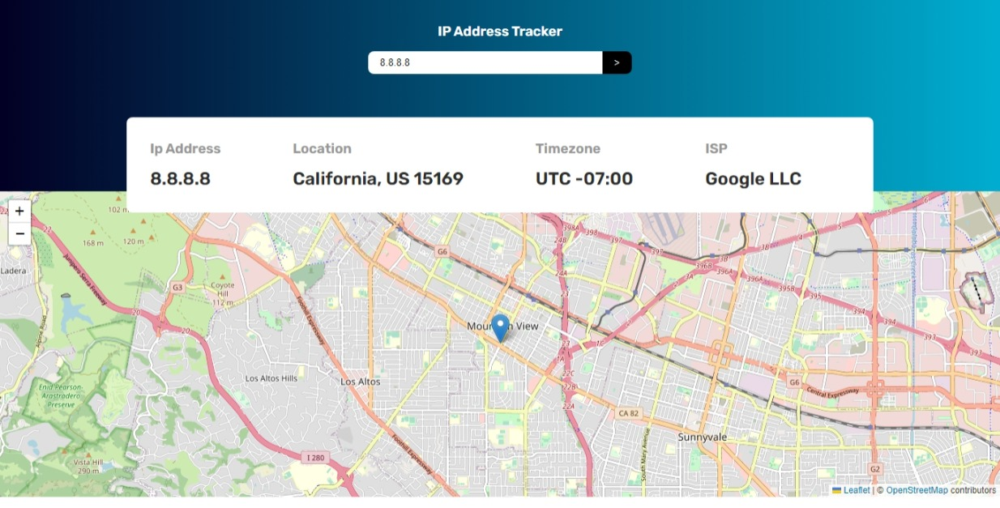
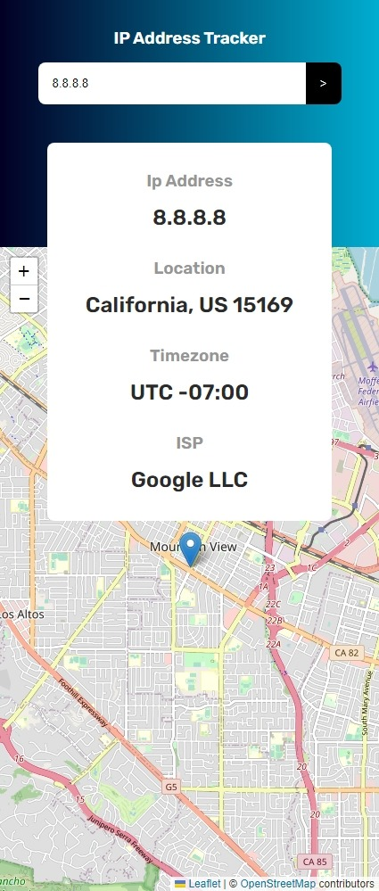

# Frontend Mentor - IP address tracker solution

This is a solution to the [IP address tracker challenge on Frontend Mentor](https://www.frontendmentor.io/challenges/ip-address-tracker-I8-0yYAH0).

## Table of contents

- [Overview](#overview)
  - [The challenge](#the-challenge)
  - [Screenshot](#screenshot)
  - [Links](#links)
- [My process](#my-process)
  - [Built with](#built-with)
  - [What I learned](#what-i-learned)
- [Author](#author)

## Overview

### The challenge

Users should be able to:

- [x] View the optimal layout for each page depending on their device's screen size
- See hover states for all interactive elements on the page
- [x] See their own IP address on the map on the initial page load
- [x] Search for any IP addresses or domains and see the key information and location

### Screenshot

#### Desktop

#### Mobile

### Links

- Solution URL: [GitHub](https://github.com/im-victor-mendez/React-Ip_Address-Tracker)
- Live Site URL: [Netlify](https://ip-address-tracker-im-victor-mendez.netlify.app/)

## My process

### Built with

- [React.js](https://reactjs.org/) - JS library
- Redux
- JavaScript
- APIs
- Semantic HTML5 markup
- CSS custom properties

### What I learned

- How to use a map.
  - How to update map center.
  - Fix map errors.

## Author

- GitHub - [im-victor-mendez](https://github.com/im-victor-mendez)
- Frontend Mentor - [@im-victor-mendez](https://www.frontendmentor.io/profile/im-victor-mendez)
